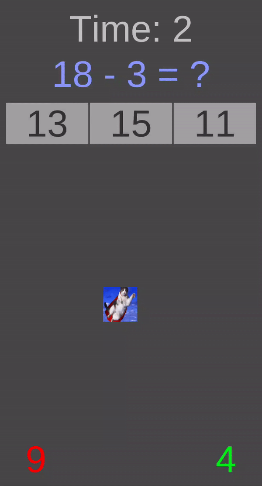

# Squareball

Squareball is an educational mobile game developed using Unity engine. The game is designed to help players improve their arithmetic skills in a fun and engaging way. 

This is the first game idea I've ever had, which was originally developed using the Corona SDK, but it was later rewritten using Unity. Eventually, this game served as a prototype for [another project](https://github.com/lnadi17/jam).

## Gameplay
The objective of the game is to control the squareball using the accelerometer in your mobile device and guide it towards the correct answer to simple arithmetic questions generated on top of the screen. Player scores a point for each correct answer touched by the squareball.

## Repository Status
This repository is archived and is no longer in development. Squareball was used as a prototype to develop a more advanced project during a hackathon later on. If you're interested, you can check out the link on GitHub: [https://github.com/lnadi17/jam](https://github.com/lnadi17/jam)
